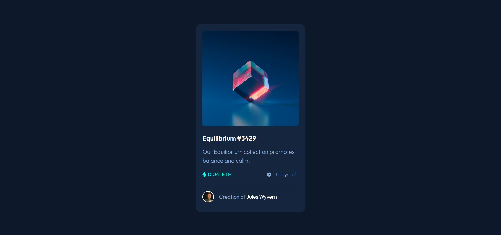
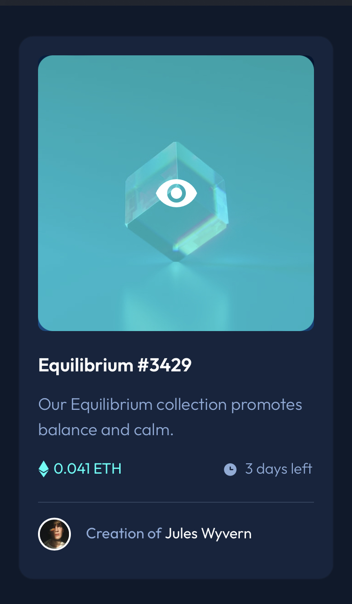

# Frontend Mentor - NFT preview card component solution

This is a solution to the [NFT preview card component challenge on Frontend Mentor](https://www.frontendmentor.io/challenges/nft-preview-card-component-SbdUL_w0U). Frontend Mentor challenges help you improve your coding skills by building realistic projects.

## Table of contents

- [Overview](#overview)
  - [The challenge](#the-challenge)
  - [Screenshot](#screenshot)
  - [Links](#links)
- [My process](#my-process)
  - [Built with](#built-with)
  - [What I learned](#what-i-learned)
  - [Useful resources](#useful-resources)
- [Author](#author)
- [Acknowledgments](#acknowledgments)

## Overview

### The challenge

Users should be able to:

- View the optimal layout depending on their device's screen size
- See hover states for interactive elements

### Screenshot

- Desktop version.
  

- Mobile version.
  

### Links

- Solution URL: [Source code on Github](https://github.com/Abaljerind/nft-preview-card)
- Live Site URL: [Product Preview Card Component](https://nft-preview-card-sand.vercel.app/)

## My process

### Built with

- Semantic HTML5 markup
- CSS custom properties
- [Bootstrap](https://getbootstrap.com/) - For styles

### What I learned

I just noticed that in order to centering the html tag right in the middle of the page browser, i can easily use the height on the body and the container of the element which i want to make it center. And last the property is place-content which is actually new for me and it really help me too, so yeah i think this is actually some of the code I'm proud of.

```html
<h1>Some code I'm proud of</h1>
```

```css
html,
body {
  ....
  height: 100%;
  margin: 0;
}

section {
  height: 100%;
}

section .card .img-container .img-see-eth {
  ....
  place-content: center;
}
```

### Useful resources

- [Bootstrap](https://getbootstrap.com/) - This helped me to do the styling more easy. I really liked this bootstrap and will use it going forward.
- [Vercel](https://vercel.com) - This is an amazing website which helped me to upload my website into the internet. I'd recommend it to anyone still learning to use this website.

## Author

- Website - [AbalJerind](https://nft-preview-card-sand.vercel.app/)
- Frontend Mentor - [@Abaljerind](https://www.frontendmentor.io/profile/Abaljerind)

## Acknowledgments

I want to thank me for believing in me, I want to thank me for doing all this hard work. I wanna thank me for having no days off. I wanna thank me for never quitting. I wanna thank me for being me at all times.
